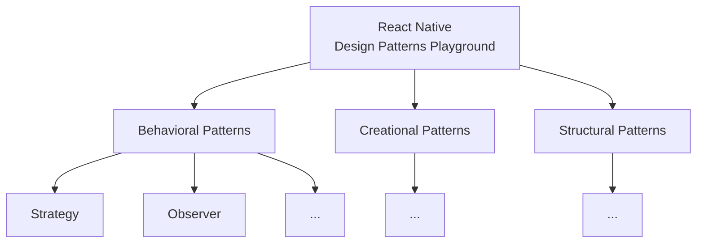

# React Native Design Patterns Playground

A practical exploration of software design patterns implemented with React Native + TypeScript. This repository contains
small, focused examples that demonstrate how common design patterns map to real-world mobile app code.

Table of Contents

- [About](#about)
- [Patterns & Demos](#patterns--demos)
- [Prerequisites](#prerequisites)
- [Quick Start](#quick-start)
- [Project Structure](#project-structure)
- [Scripts](#scripts)
- [Contributing](#contributing)
- [License](#license)

---

## About

Each pattern lives under src/patterns and includes a short README, implementation, and a small demo screen that can be
opened from the app. The goal is to learn how patterns improve maintainability and testability in React Native.

## Patterns & Demos

Explore the patterns by category.



### 🧠 Behavioral Patterns

Patterns that focus on communication between objects and how behavior can vary independently.

| Pattern      | Example                                                                  | Status         |
|--------------|--------------------------------------------------------------------------|----------------|
| **Strategy** | [Dynamic Payment Processing](src/patterns/behavioral/strategy/README.md) | ✅ Available    |
| **Observer** | [Authentication Event Notifications](/src/patterns/behavioral/observer/README.md)    | ✅ Available   |
| TBD     | —                                                                        | 🚧 Coming soon |

[//]: # (| Command | — | 🚧 Coming soon |)

[//]: # (| State | — | 🚧 Coming soon |)

[//]: # (| Chain of Responsibility | — | 🚧 Coming soon |)

[//]: # (| Template Method | — | 🚧 Coming soon |)

[//]: # (| Iterator | — | 🚧 Coming soon |)

[//]: # (| Mediator | — | 🚧 Coming soon |)

[//]: # (| Memento | — | 🚧 Coming soon |)

[//]: # (| Visitor | — | 🚧 Coming soon |)

[//]: # (| Interpreter | — | 🚧 Coming soon |)

### 🏗️ Creational Patterns

Patterns that focus on object creation and initialization.

| Pattern | Example | Status |
|---------|---------|--------|

[//]: # (| Factory Method | — | 🚧 Coming soon |)

[//]: # (| Abstract Factory | — | 🚧 Coming soon |)

[//]: # (| Builder | — | 🚧 Coming soon |)

[//]: # (| Prototype | — | 🚧 Coming soon |)

[//]: # (| Singleton | — | 🚧 Coming soon |)

### 🧩 Structural Patterns

Patterns that focus on how objects and classes are composed.

| Pattern | Example | Status |
|---------|---------|--------|

[//]: # (| Adapter | — | 🚧 Coming soon |)

[//]: # (| Bridge | — | 🚧 Coming soon |)

[//]: # (| Composite | — | 🚧 Coming soon |)

[//]: # (| Decorator | — | 🚧 Coming soon |)

[//]: # (| Facade | — | 🚧 Coming soon |)

[//]: # (| Flyweight | — | 🚧 Coming soon |)

[//]: # (| Proxy | — | 🚧 Coming soon |)

**(Use the app demo screens to try each pattern interactively.)**

---

## Prerequisites

- Node.js (16+) and npm or Yarn
- Xcode for iOS development (macOS)
- Android Studio + Android SDK for Android
- CocoaPods (for iOS native dependencies)

## Quick Start

1. Install dependencies:

```sh
# npm
npm install

# or yarn
# yarn install
```

2. Start Metro:

```sh
npm start
# or
# yarn start
```

3. Run on Android:

```sh
npm run android
```

4. Run on iOS (macOS only):

```sh
bundle install
bundle exec pod install --project-directory=ios
npm run ios
```

## Project Structure

```
src/
  patterns/         # Pattern implementations + READMEs
    strategy/       # Strategy pattern example + demo screen
  demo/              # App demo screens
  services/          # Example services used by demos
```

## Scripts

Common npm scripts (see package.json for exact commands):

- npm start — start Metro bundler
- npm run android — build & install on Android emulator/device
- npm run ios — build & run on iOS simulator (macOS)
- npm test — run tests

## Contributing

Contributions welcome. Please open issues for ideas or PRs with small, focused changes. Keep demos self-contained and
add tests for new examples.

## License

This project is licensed under the MIT License — see the [LICENSE](./LICENSE) file for details.


