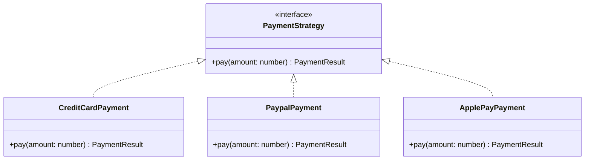
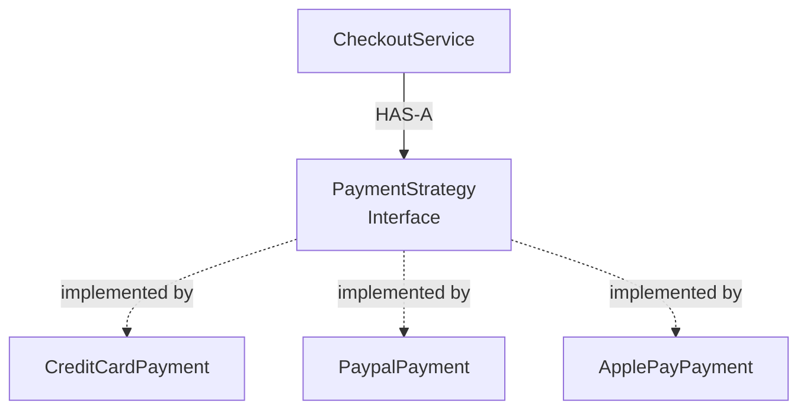
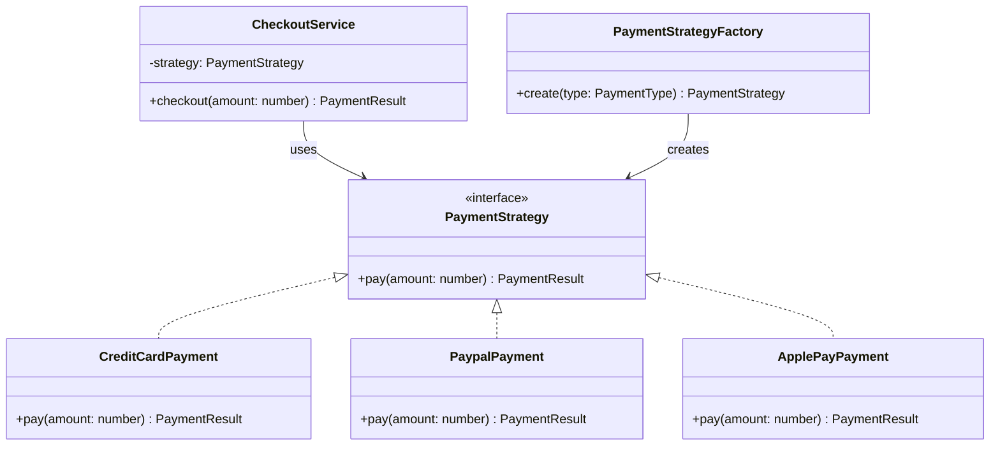
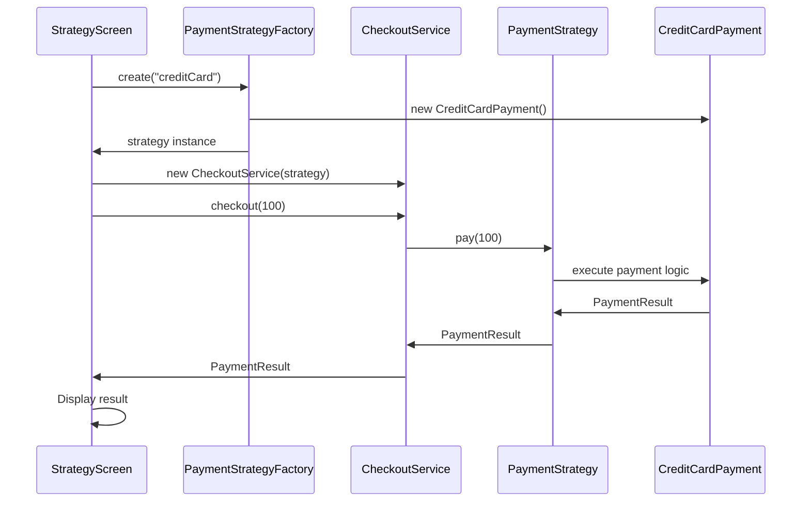

# Strategy Pattern

## Dynamic Payment Processing

The **Strategy Pattern** is a behavioral design pattern that defines a family of algorithms, encapsulates each one separately, and makes them interchangeable at runtime.

In this example, we simulate a payment system where users can choose different payment methods:

* Credit Card
* PayPal
* Apple Pay

The checkout flow remains unchanged while the payment behavior can be switched dynamically.

---

## 🎯 The Problem

Imagine a checkout implementation without the Strategy Pattern:

```typescript
class CheckoutService {
  checkout(paymentType: string, amount: number) {
    if (paymentType === 'creditCard') {
      console.log('Processing credit card...');
    } else if (paymentType === 'paypal') {
      console.log('Processing PayPal...');
    } else if (paymentType === 'applePay') {
      console.log('Processing Apple Pay...');
    }
  }
}
```

As more payment methods are added, the checkout service becomes increasingly difficult to maintain.

### The scalability problem

```text
CheckoutService
├── creditCard logic
├── PayPal logic
├── Apple Pay logic
├── Google Pay logic
└── ...more conditions
```

Every new payment method requires modifying the existing checkout logic.

This creates:

* High coupling
* Increasing complexity
* Difficult testing
* Violation of the Open/Closed Principle

---

## 💡 The Strategy Solution

Instead of embedding every payment algorithm inside `CheckoutService`, we define a common contract:

```typescript
interface PaymentStrategy {
  pay(amount: number): PaymentResult;
}
```

Each payment method implements the contract independently.



Now `CheckoutService` depends on the abstraction instead of concrete payment implementations.

---

## 🧩 Composition Over Inheritance

One of the key ideas behind the Strategy Pattern is **composition rather than inheritance**.

### Is-A — Inheritance

Inheritance creates a rigid relationship:

```text
PaymentProcessor
       │
 ┌─────┼─────┐
 ▼     ▼     ▼
Card  PayPal ApplePay
```

The behavior is tied to the class hierarchy.

### Has-A — Composition

With Strategy, the checkout service **has a strategy**:



This allows the behavior to be changed without changing the checkout flow.

---

## 🏗️ Architecture



### Responsibilities

| Component                | Responsibility                   |
| ------------------------ | -------------------------------- |
| `PaymentStrategy`        | Defines the contract             |
| `CreditCardPayment`      | Implements credit-card behavior  |
| `PaypalPayment`          | Implements PayPal behavior       |
| `ApplePayPayment`        | Implements Apple Pay behavior    |
| `CheckoutService`        | Coordinates checkout             |
| `PaymentStrategyFactory` | Creates the appropriate strategy |

---

## 🔄 Runtime Behavior

The runtime flow looks like this:



The important part is that the checkout flow does not change when the selected payment strategy changes.

---

## 💻 Implementation

### Project Structure

```text
src/patterns/strategy/
├── domain/
│   ├── PaymentStrategy.ts
│   ├── PaymentType.ts
│   ├── PaymentResult.ts
│   └── payment/
│       ├── CreditCardPayment.ts
│       ├── PaypalPayment.ts
│       └── ApplePayPayment.ts
├── services/
│   └── CheckoutService.ts
├── factories/
│   └── PaymentStrategyFactory.ts
└── demo/
    └── StrategyScreen.tsx
```

### PaymentStrategy

```typescript
export interface PaymentStrategy {
  pay(amount: number): PaymentResult;
}
```

This interface defines the contract that every payment strategy must follow.

### Concrete Strategy

```typescript
export class CreditCardPayment implements PaymentStrategy {
  pay(amount: number): PaymentResult {
    return {
      success: true,
      message: `Paid ${amount} using Credit Card`,
    };
  }
}
```

Each payment implementation can evolve independently.

### CheckoutService

```typescript
export class CheckoutService {
  constructor(private paymentStrategy: PaymentStrategy) {}

  checkout(amount: number) {
    return this.paymentStrategy.pay(amount);
  }
}
```

The service knows how to coordinate checkout, but it does not need to know which payment method is being used.

---

## 🏭 Factory + Strategy

The example also uses a Factory to create the appropriate Strategy.

These patterns solve different problems:

|                 | Strategy                          | Factory                         |
| --------------- | --------------------------------- | ------------------------------- |
| Purpose         | Defines interchangeable behavior  | Creates objects                 |
| Main question   | "How should this operation work?" | "Which object should I create?" |
| In this example | Executes payment behavior         | Creates payment strategy        |


The **Factory creates** the strategy.

The **Strategy executes** the behavior.

---

## 🧪 Testing

Strategies can be tested independently:

```typescript
describe('CreditCardPayment', () => {
  it('should return success', () => {
    const payment = new CreditCardPayment();

    const result = payment.pay(100);

    expect(result.success).toBe(true);
  });
});
```

And the `CheckoutService` can test its dependency independently:

```typescript
describe('CheckoutService', () => {
  it('should execute payment strategy', () => {
    const mockStrategy: PaymentStrategy = {
      pay: jest.fn().mockReturnValue({
        success: true,
        message: 'Paid',
      }),
    };

    const checkout = new CheckoutService(mockStrategy);

    checkout.checkout(100);

    expect(mockStrategy.pay).toHaveBeenCalledWith(100);
  });
});
```

---

## ⚖️ Design Trade-offs

### Advantages

* Low coupling
* Easy to add new behaviors
* Runtime strategy switching
* Independent testing
* Clear separation of responsibilities
* Supports the Open/Closed Principle

### Disadvantages

* Introduces additional classes/interfaces
* Can be unnecessary for very simple problems
* The number of strategies can grow as the domain grows

---

## 🚫 When Not to Use Strategy

Avoid the pattern when:

* There is only one possible behavior
* The behavior is unlikely to change
* Adding abstractions would make a simple problem harder to understand
* The variation is trivial and doesn't justify separate strategies

The goal is not to use a design pattern everywhere.

The goal is to use the pattern when it makes the design **simpler, more flexible, and easier to maintain**.

---

## 🌍 Real-World Examples

Strategy can be useful for:

* Payment processing
* Sorting algorithms
* Notification delivery
* Export formats
* Authentication methods
* Compression algorithms

The common characteristic is the same:

> **Multiple interchangeable ways to perform the same kind of operation.**

---

## 🧠 Design Principles

This implementation demonstrates several SOLID principles.

### Single Responsibility Principle

Each component has a focused responsibility.

### Open/Closed Principle

New payment strategies can be introduced without changing the checkout algorithm.

### Dependency Inversion Principle

`CheckoutService` depends on the `PaymentStrategy` abstraction rather than a concrete payment implementation.

---

## 📱 React Native Demo

The pattern is demonstrated through a React Native screen where the user selects a payment method and executes the checkout flow.

The UI is responsible for user interaction, while the payment behavior is delegated to the selected Strategy.

---

## 📚 Source Code

[View the Strategy Pattern implementation on GitHub](https://github.com/sallySalem/react-native-pattern-playground/tree/main/src/patterns/strategy)
