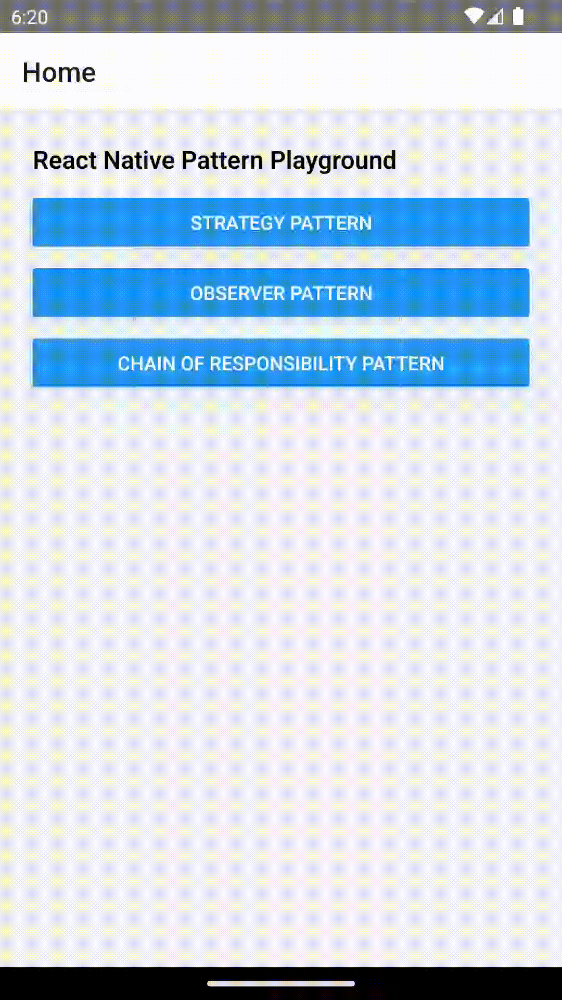
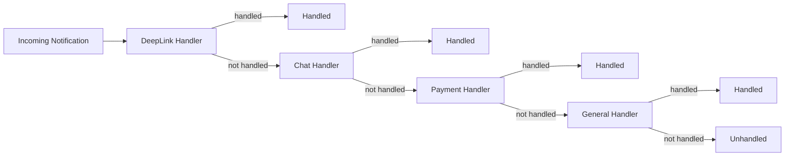
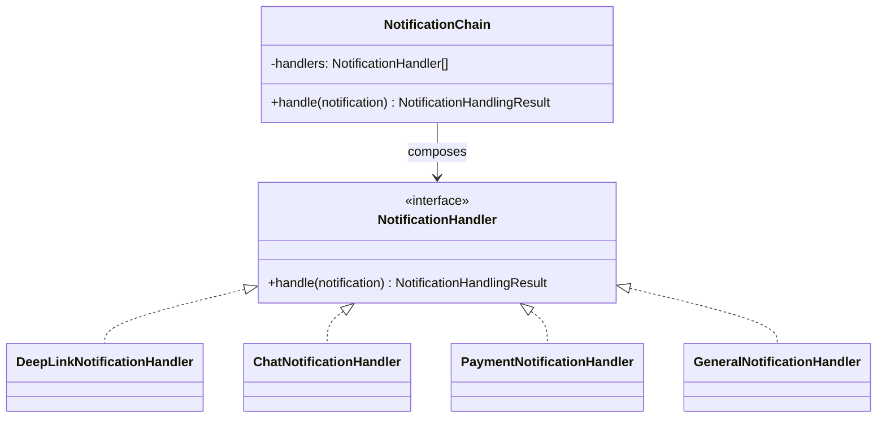

# Chain of Responsibility — Notification Handling

## Overview

The Chain of Responsibility is a **behavioral pattern** that passes a request along a chain of handlers
until one of them handles it. This keeps each handler focused on a single responsibility and avoids
large conditional blocks.

In this example, we use notifications:

* Deep Link
* Chat
* Payment
* General

The sender only knows about the chain — not which handler will process the notification.

## The Problem Without the Pattern

Hardcoding if/else or switch statements to route notifications leads to code that is hard to extend and test.
Every new notification type requires changing a central dispatcher.

```typescript
  if (notification.type === 'deep-link') {
    // handle deep link 
} else if (notification.type === 'chat') {
    // handle chat 
} else if (notification.type === 'payment') {
    // handle payment 
} else if (notification.type === 'general') {
    // handle general 
} else {

}
```

**Problems**

* ❌ High coupling
* ❌ Growing if/else logic
* ❌ Harder to extend
* ❌ Harder to test
* ❌ One component knows every handler

## Chain of Responsibility Solution

Instead of one component knowing how to handle every notification, we create independent handlers.

**Each handler either:**

1. Handles the notification
2. Passes it to the next handler

**Benefits:**

- Decouples routing logic from handling logic
- Easy to add new handlers without modifying existing ones
- Handlers are easy to unit-test

## Demo

<p align="center">
  
</p>

## Simple flow (diagram)



---

## Composition Over Inheritance

The handlers do **not** inherit from a base handler.

They all implement the same contract:

```ts
interface NotificationHandler {
    handle(
        notification: Notification
    ): NotificationHandlingResult;
}
```

The chain is composed from handlers:

```ts
new NotificationChain([
    new DeepLinkNotificationHandler(),
    new ChatNotificationHandler(),
    new PaymentNotificationHandler(),
    new GeneralNotificationHandler(),
]);
```

This keeps the design flexible and avoids a rigid inheritance hierarchy.

---

## Architecture



The chain depends on the **abstraction**, not concrete handlers.

---

## Design Principles

### 🔹 Loose Coupling

The caller does not know which handler will process the notification.

### 🔹 Composition Over Inheritance

Handlers are composed into a chain instead of extending a base handler.

### 🔹 Single Responsibility

Each handler has one responsibility:

```text
DeepLinkHandler  → Deep Links
ChatHandler      → Chat
PaymentHandler   → Payments
GeneralHandler   → General notifications
```

### 🔹 Open/Closed Principle

New notification types can be added by creating a new handler without changing the existing handlers.

### 🔹 Dependency Inversion

The chain works with the `NotificationHandler` interface rather than concrete handler classes.

### 🔹 Separation of Concerns

The domain handles the request.

The UI decides how the result should be displayed.

```text
Handler
   ↓
Domain Result
   ↓
UI
   ↓
getComponent()
   ↓
React Component
```

---

## When to Use

Use Chain of Responsibility when:

- Multiple objects may handle the same request.
- The sender should not know the specific handler.
- Handling order matters.
- You want to add or reorder handlers easily.
- You want to avoid large conditional blocks.

## When not to use

- If there is only one receiver or the routing logic is trivial
- If you need guaranteed, ordered processing by all handlers (use Observer instead)

---


