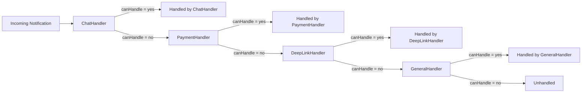
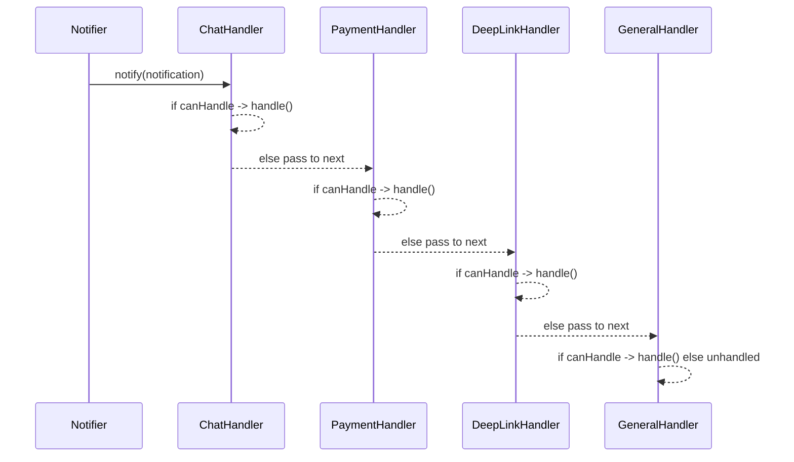

# Chain of Responsibility — Notification Handling

## Overview

The Chain of Responsibility is a behavioral pattern that passes a request along a chain of handlers
until one of them handles it. This keeps each handler focused on a single responsibility and avoids
large conditional blocks.

This example shows how incoming notifications (chat, payment, deep-link, general) can be routed to
the correct handler without a central switch/case.

## Problem

Hardcoding if/else or switch statements to route notifications leads to code that is hard to extend and test.
Every new notification type requires changing a central dispatcher.

## Solution

Create independent handlers that know how to handle one notification type. Each handler decides whether
it can process the incoming notification; if not, it passes the request to the next handler.

Benefits:

- Decouples routing logic from handling logic
- Easy to add new handlers without modifying existing ones
- Handlers are easy to unit-test

## Project structure

```
src/patterns/behavioral/chain-of-responsibility/
├── implementation/
│   ├── domain/notification.ts        (Notification type)
│   └── handlers/
│       ├── NotificationHandler.ts    (Interface)
│       ├── ChatNotificationHandler.ts
│       ├── PaymentNotificationHandler.ts
│       ├── DeepLinkNotificationHandler.ts
│       └── GeneralNotificationHandler.ts
└── demo/
	└── ChainOfResponsibilityScreen.tsx
```

## Core types (quick)

- `Notification` — union type describing incoming notifications
- `NotificationHandler` — handler interface with `canHandle(notification): boolean` and `handle(notification): void`

## Simple flow (diagram)



## Sequence (runtime)



## When to use

- When multiple handlers may process a request and you want to decouple sender from receiver
- When responsibility for processing should be dynamic or configurable at runtime

## When not to use

- If there is only one receiver or the routing logic is trivial
- If you need guaranteed, ordered processing by all handlers (use Observer instead)

## Notes about this implementation

- `Notification` is defined in `implementation/domain/notification.ts` and exported for handlers.
- `NotificationHandler` uses the primitive `boolean` for `canHandle` (not `Boolean`).
- Handler implementations live under `implementation/handlers/` and should export a reference to the next handler
  or be wired together by a small coordinator in `demo/`.

---

If you'd like, I can also implement the concrete handlers and a small demo screen that wires the chain together.

