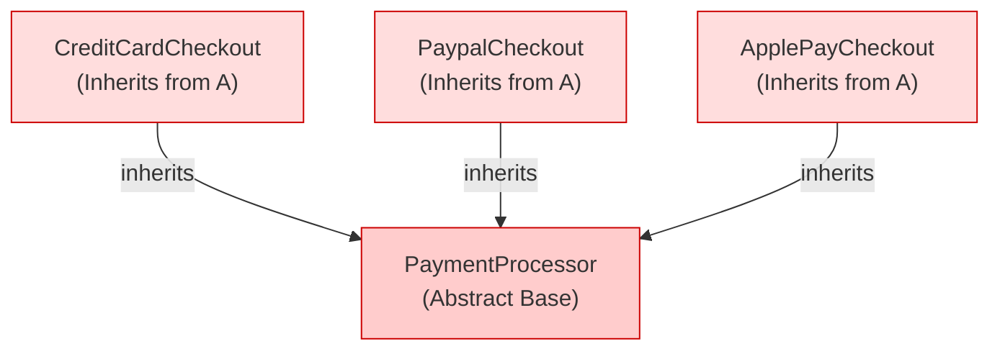
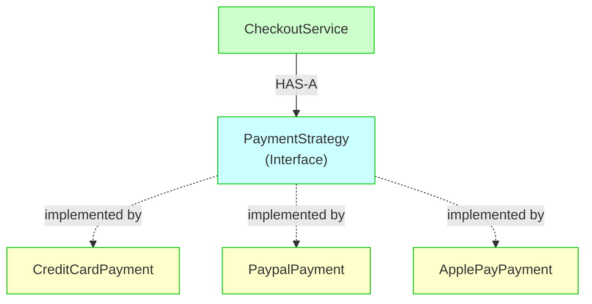
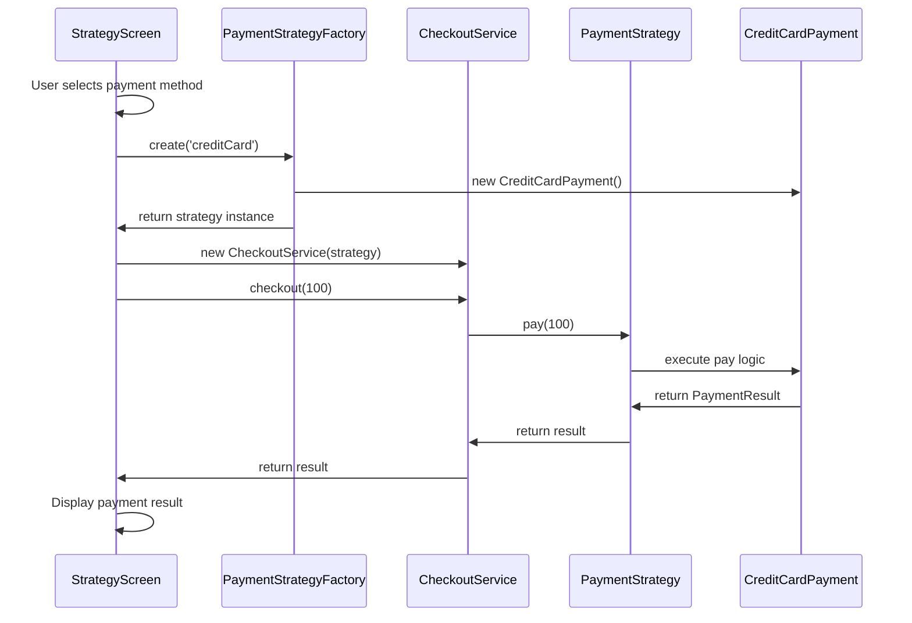

# Strategy Pattern - Dynamic Payment Processing

## Overview

The **Strategy Pattern** is a behavioral design pattern that allows defining a family of algorithms, encapsulating each one separately, and making them interchangeable at runtime.

In this example, we simulate a payment system where users can choose different payment methods at runtime:

- 💳 **Credit Card**
- 🅿️ **PayPal**
- 🍎 **Apple Pay**

The application can switch between these payment behaviors without changing the checkout flow. This demonstrates how the Strategy Pattern provides flexibility and maintainability in complex business logic.

---

## The Problem Without Strategy Pattern

Imagine a simple checkout implementation without the Strategy Pattern:

```typescript
class CheckoutService {
  checkout(paymentType: string, amount: number) {
    if (paymentType === "creditCard") {
      // Credit card logic
      console.log("Processing credit card...");
    } else if (paymentType === "paypal") {
      // PayPal logic
      console.log("Processing PayPal...");
    } else if (paymentType === "applePay") {
      // Apple Pay logic
      console.log("Processing Apple Pay...");
    }
  }
}
```

### Issues with This Approach

#### 1. **High Coupling** 🔗

The checkout logic knows **every payment implementation**. Adding a new payment method requires modifying existing code.

```typescript
// Adding Google Pay means modifying the CheckoutService
if (paymentType === "googlePay") {
  // New logic...
}
```

#### 2. **Violates Open/Closed Principle (OCP)** ❌

The code is **not closed for modification**. Every new payment type requires changing existing classes.

**Before adding Google Pay:**
```
CheckoutService
  └─ if/else logic (closed for extension)
```

**After adding Google Pay:**
```
CheckoutService (modified!)
  └─ if/else logic (still more conditions...)
```

#### 3. **Difficult Testing** 🧪

The checkout service contains multiple behaviors, making tests harder to isolate and harder to mock individual payment methods.

#### 4. **Maintenance Nightmare** 🔥

Every new payment method increases the complexity of the `CheckoutService`. The code becomes harder to read and understand as it grows.

---

## Strategy Pattern Solution

Instead of embedding payment algorithms inside the checkout flow, we define a common contract:

```typescript
interface PaymentStrategy {
  pay(amount: number): PaymentResult;
}
```

Each payment method implements this contract independently:

```
PaymentStrategy (Interface - The Contract)
      ▲
      │
      ├─────────────────────────────────┐
      │                                 │
CreditCardPayment        PaypalPayment        ApplePayPayment
```

Now the checkout process depends only on the abstraction, not concrete implementations.

---

## Architecture Diagram

```mermaid
graph TD
    A["📱 StrategyScreen<br/>(UI - User Selection)"]
    B["🏭 PaymentStrategyFactory<br/>(Object Creation)"]
    C["🛒 CheckoutService<br/>(Business Logic)"]
    D["📋 PaymentStrategy Interface<br/>(The Contract)"]
    E["💳 CreditCardPayment<br/>(Implementation)"]
    F["🅿️ PaypalPayment<br/>(Implementation)"]
    G["🍎 ApplePayPayment<br/>(Implementation)"]

    A -->|1. Select Payment Method| B
    B -->|2. Create Strategy| C
    C -->|3. Depends on Interface| D
    D -->|implements| E
    D -->|implements| F
    D -->|implements| G
    E -->|executes pay()| D
    F -->|executes pay()| D
    G -->|executes pay()| D
```

---

## Has-A vs Is-A: Composition Over Inheritance

### Understanding the Difference

#### **Is-A Relationship (Inheritance)** ❌ *Not used in Strategy Pattern*

```typescript
// Is-A: "CheckoutService IS-A PaymentProcessor"
// (Tight coupling through inheritance)

abstract class PaymentProcessor {
  abstract pay(amount: number): PaymentResult;
}

class CheckoutServiceWithInheritance extends PaymentProcessor {
  // Must override pay() - rigid, single inheritance only
  pay(amount: number): PaymentResult {
    // Implementation is tightly bound
  }
}
```

**Problems with Is-A:**
- ❌ Tight coupling between parent and child
- ❌ Can only inherit from one class
- ❌ Changes to parent affect all children
- ❌ Difficult to switch behaviors at runtime

#### **Has-A Relationship (Composition)** ✅ *Used in Strategy Pattern*

```typescript
// Has-A: "CheckoutService HAS-A PaymentStrategy"
// (Loose coupling through composition)

interface PaymentStrategy {
  pay(amount: number): PaymentResult;
}

class CheckoutService {
  constructor(private paymentStrategy: PaymentStrategy) {}

  checkout(amount: number): PaymentResult {
    return this.paymentStrategy.pay(amount);
  }
}
```

**Benefits of Has-A:**
- ✅ Loose coupling - CheckoutService doesn't depend on concrete classes
- ✅ Can use multiple strategies through composition
- ✅ Easy to swap strategies at runtime
- ✅ Strategies can be tested independently

### Visual Comparison

#### **Is-A (Inheritance) - Rigid Hierarchy**



**Issues:**
- Need separate class for each payment method
- If you want to switch at runtime, you're stuck
- Can't combine multiple payment types easily

#### **Has-A (Composition) - Flexible & Dynamic**



**Benefits:**
- Same `CheckoutService` for all payment types
- Switch strategies at runtime
- Easy to add new payment methods
- Better for testing

### Side-by-Side Code Comparison

**Is-A (Inheritance) ❌**
```typescript
// Hard to extend, hard to test
class CheckoutService {
  private processor: PaymentProcessor; // Still couples to abstract class

  checkout(amount: number) {
    return this.processor.pay(amount);
  }
}

const checkout = new CreditCardCheckout(); // Creates specific class
checkout.pay(100); // Can't switch at runtime
```

**Has-A (Composition) ✅**
```typescript
// Easy to extend, easy to test, easy to switch
class CheckoutService {
  constructor(private strategy: PaymentStrategy) {} // Couples only to interface

  checkout(amount: number) {
    return this.strategy.pay(amount);
  }
}

const creditCard = new CreditCardPayment();
const checkout = new CheckoutService(creditCard);
checkout.checkout(100);

// Switch strategy at runtime!
const paypal = new PaypalPayment();
const newCheckout = new CheckoutService(paypal);
newCheckout.checkout(100);
```

---

## Benefits of Strategy Pattern

### 1. **Runtime Behavior Switching** 🔄

The user can change the payment behavior while the application is running without recreating the checkout service.

**Flow:**
```
User selects PayPal
    ↓
PaypalPayment strategy is selected by factory
    ↓
CheckoutService executes PayPal behavior
    ↓
Checkout flow remains unchanged
```

### 2. **Better Separation of Responsibilities** 🎯

Each component has a single, well-defined responsibility:

**Before Strategy:**
```
StrategyScreen
├─ UI rendering
├─ Payment creation logic
├─ Payment method selection
└─ Payment algorithm selection
    (Too many responsibilities!)
```

**After Strategy:**
```
StrategyScreen
├─ UI rendering
└─ User selection

PaymentStrategyFactory
└─ Object creation logic

CheckoutService
└─ Checkout flow coordination

CreditCardPayment / PaypalPayment / ApplePayPayment
└─ Specific payment algorithms
```

### 3. **Easier Extension** 📦

Adding a new payment method doesn't require modifying existing code:

**Before:**
```typescript
// Must modify CheckoutService
if (paymentType === "googlePay") {
  // Add Google Pay logic
}
```

**After:**
```typescript
// Create new strategy, nothing else changes
class GooglePayPayment implements PaymentStrategy {
  pay(amount: number): PaymentResult {
    return {
      success: true,
      message: `Paid ${amount} using Google Pay`,
    };
  }
}

// Update factory to handle new type
export type PaymentType = 'creditCard' | 'paypal' | 'applePay' | 'googlePay';
```

### 4. **Improved Testability** 🧪

Each payment method can be tested independently:

```typescript
// Easy to test individual strategies
describe('CreditCardPayment', () => {
  it('should return success', () => {
    const payment = new CreditCardPayment();
    const result = payment.pay(100);
    expect(result.success).toBe(true);
  });
});

// Easy to mock strategies in CheckoutService
describe('CheckoutService', () => {
  it('should execute payment strategy', () => {
    const mockStrategy: PaymentStrategy = {
      pay: jest.fn().mockReturnValue({ success: true, message: 'Paid' }),
    };
    const checkout = new CheckoutService(mockStrategy);
    checkout.checkout(100);
    expect(mockStrategy.pay).toHaveBeenCalledWith(100);
  });
});
```

### 5. **Follows SOLID Principles** ✨

- **Single Responsibility Principle (SRP):** Each class has one responsibility
- **Open/Closed Principle (OCP):** Open for extension, closed for modification
- **Dependency Inversion Principle (DIP):** Depends on abstractions, not concrete classes

---

## Our Implementation

### Project Structure

```
src/patterns/strategy/
├── domain/
│   ├── PaymentStrategy.ts          (Interface - The Contract)
│   ├── PaymentType.ts              (Type definition)
│   ├── PaymentResult.ts            (Result type)
│   └── payment/
│       ├── CreditCardPayment.ts    (Concrete Strategy)
│       ├── PaypalPayment.ts        (Concrete Strategy)
│       └── ApplePayPayment.ts      (Concrete Strategy)
├── services/
│   └── CheckoutService.ts          (Coordinator)
├── factories/
│   └── PaymentStrategyFactory.ts   (Factory for creating strategies)
└── demo/
    └── StrategyScreen.tsx          (React Native UI)
```

### Core Components

#### 1. **PaymentStrategy Interface**

```typescript
export interface PaymentStrategy {
  pay(amount: number): PaymentResult;
}
```

The contract that all payment implementations must follow.

#### 2. **Concrete Strategies**

```typescript
export class CreditCardPayment implements PaymentStrategy {
  pay(amount: number): PaymentResult {
    return {
      success: true,
      message: `Paid ${amount} using Credit Card`,
    };
  }
}
```

Each payment method independently implements the interface.

#### 3. **PaymentStrategyFactory**

```typescript
export class PaymentStrategyFactory {
  static create(type: PaymentType): PaymentStrategy {
    switch (type) {
      case 'creditCard':
        return new CreditCardPayment();
      case 'paypal':
        return new PaypalPayment();
      case 'applePay':
        return new ApplePayPayment();
      default:
        throw new Error(`Unsupported payment type ${type}`);
    }
  }
}
```

Centralizes object creation. If you need to change how strategies are created, you only modify this class.

#### 4. **CheckoutService**

```typescript
export class CheckoutService {
  constructor(private paymentStrategy: PaymentStrategy) {}

  checkout(amount: number) {
    return this.paymentStrategy.pay(amount);
  }
}
```

The coordinator. It doesn't know which payment method is used—it just knows how to coordinate the checkout.

#### 5. **StrategyScreen (React Native UI)**

```typescript
const handlePayment = () => {
  // 1. Factory creates the strategy based on user selection
  const paymentStrategy = PaymentStrategyFactory.create(selectedPayment);

  // 2. Create checkout service with the strategy
  const checkout = new CheckoutService(paymentStrategy);

  // 3. Execute checkout (delegates to the selected strategy)
  const paymentResult = checkout.checkout(100);

  setResult(paymentResult.message);
};
```

The UI layer doesn't contain any payment logic—it just orchestrates.

---

## Complete Data Flow Diagram



---

## When to Use Strategy Pattern

✅ **Use Strategy Pattern when:**

- Multiple algorithms/behaviors exist for the same operation
- Behaviors change independently
- Runtime switching is required
- You want to avoid long if/else chains
- You expect future extensions
- You need better testability

❌ **Avoid Strategy Pattern when:**

- Only one behavior exists (unnecessary abstraction)
- The problem is simple and unlikely to change
- Performance is critical (strategy switching has overhead)
- You're working with a very small team/codebase

---

## Design Principles Applied

### Single Responsibility Principle (SRP)

Each class has **one reason to change**:

- `CreditCardPayment` changes only when credit card logic changes
- `CheckoutService` changes only when checkout flow changes
- `PaymentStrategyFactory` changes only when object creation logic changes

### Open/Closed Principle (OCP)

The system is **open for extension, closed for modification**:

Adding Google Pay doesn't require modifying any existing class—just add:
```typescript
class GooglePayPayment implements PaymentStrategy { }
```

### Dependency Inversion Principle (DIP)

High-level modules depend on abstractions:

```typescript
// ✅ Good: Depends on interface
class CheckoutService {
  constructor(private paymentStrategy: PaymentStrategy) {}
}

// ❌ Bad: Depends on concrete class
class CheckoutService {
  constructor(private creditCard: CreditCardPayment) {}
}
```

---

## Comparison: Strategy vs Factory Pattern

| Aspect | Strategy Pattern | Factory Pattern |
|--------|------------------|-----------------|
| **Purpose** | How behavior is executed | How objects are created |
| **Focus** | Algorithm selection | Object creation |
| **Question Answered** | "What should I do?" | "What should I create?" |
| **Used For** | Different ways to perform same task | Creating different types of objects |
| **Example** | Payment methods | Creating payment strategy objects |

**In our implementation:**
- **Factory** creates the right strategy object
- **Strategy** executes the selected behavior


---

## Key Takeaways 🎓

1. **Strategy Pattern = Behavior at Runtime**
   - Define a family of algorithms
   - Encapsulate each one
   - Make them interchangeable

2. **Has-A > Is-A**
   - Composition provides flexibility
   - Inheritance creates rigid hierarchies

3. **SOLID Principles in Action**
   - Single Responsibility
   - Open/Closed
   - Dependency Inversion

4. **Real-World Applications**
   - Payment processors (our example)
   - Sorting algorithms
   - Export formats (PDF, Excel, CSV)
   - Compression algorithms
   - Routing strategies
   - Authentication methods

---

## Testing

All implementations include comprehensive tests:

```bash
# Run strategy pattern tests
npm test -- patterns/strategy

# Test coverage
npm test -- patterns/strategy --coverage
```

Test files:
- `CreditCardPayment.test.ts`
- `PaypalPayment.test.ts`
- `ApplePayPayment.test.ts`
- `PaymentStrategyFactory.test.ts`
- `CheckoutService.test.ts`
- `StrategyScreen.test.tsx`

---

## References & Resources

- [Strategy Pattern - Refactoring Guru](https://refactoring.guru/design-patterns/strategy)
- [TypeScript Handbook - Interfaces](https://www.typescriptlang.org/docs/handbook/interfaces.html)
- [SOLID Principles in TypeScript](https://www.digitalocean.com/community/tutorials/s-o-l-i-d-one-o-responsibility-principle)
- [Composition vs Inheritance](https://www.codementor.io/@danielebogo/composition-vs-inheritance-in-object-oriented-design-38n5e0t9f)

---

## Code Quality Notes

✅ **What's Good About This Implementation:**

- Clear separation of concerns
- Easy to test (mockable strategies)
- Easy to extend (new payment methods)
- Type-safe (TypeScript interfaces)
- Follows React best practices
- Factory pattern for object creation
- Comprehensive test coverage

🔧 **Future Improvements:**

- Add error handling and validation
- Implement strategy pooling/caching
- Add logging and monitoring
- Support async payment operations
- Add transaction history
- Implement retry logic

---

**Created with ❤️ for clean architecture in React Native**
