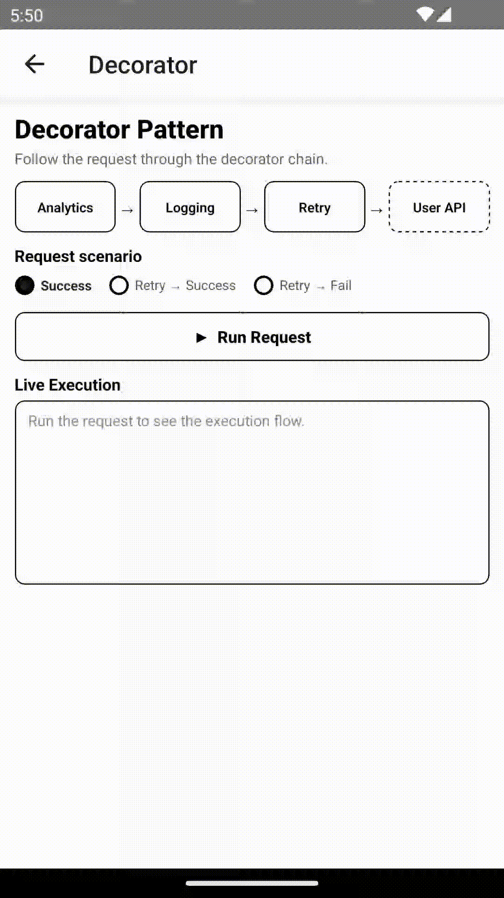
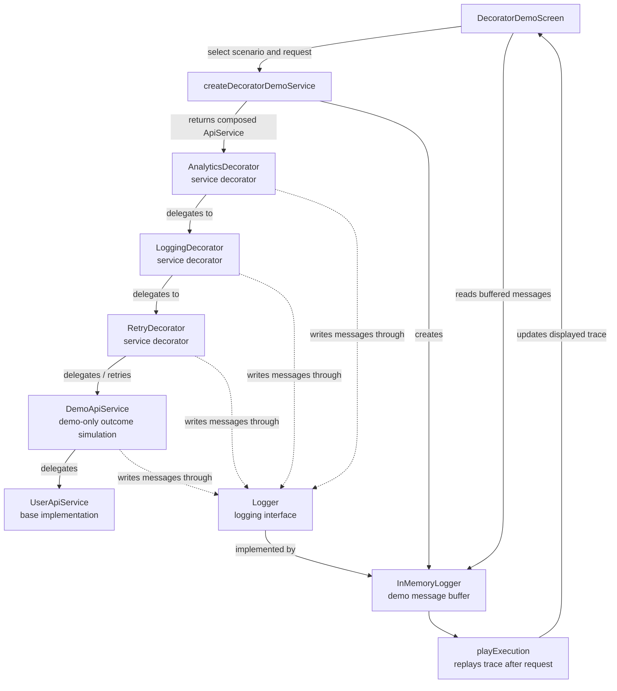
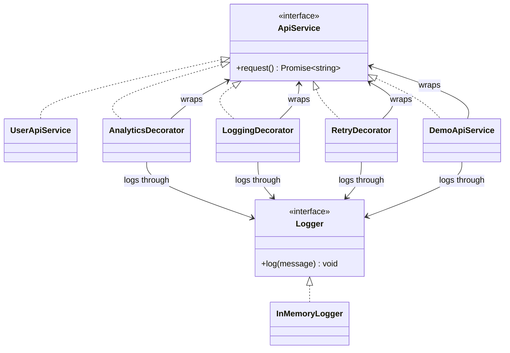

# Decorator Pattern — API Service Behavior

## Overview

**Decorator is a Structural Design Pattern.**

It allows us to add responsibilities or behavior to an object dynamically by wrapping it with other objects that
implement the same interface. The pattern's classification describes **how** the behavior is added (wrapping and
composition), not **which** behaviors are added (such as analytics, logging, or retry).

This example is stored under the repository's `behavioral` patterns directory, but Decorator is classified as a
**structural** pattern.

This example composes an API service with three behaviors:

- Analytics (represented by demo log messages)
- Logging
- Retry

Each decorator implements the same `ApiService` interface as the service it wraps, so callers can use the same
contract regardless of which decorators are composed.

`DemoApiService` is an extra layer used only to simulate outcomes in the interactive demo; it is not one of the three
behavior decorators. `UserApiService` is the base service in this example.

## The Problem Without the Pattern

One way to add cross-cutting behavior is to put everything inside the API service:

```ts
class UserApiService {
    async request(): Promise<string> {
        // Analytics
        // Logging
        // Retry
        // API request
        return 'User data';
    }
}
```

As behaviors accumulate, the service takes on unrelated responsibilities and changes whenever a new behavior is added.

### Problems

- Too many responsibilities in one class
- API logic becomes coupled to logging, analytics, and retry details
- Harder to test behaviors independently
- New behavior requires modifying the existing service
- Different combinations of behavior can lead to many specialized service classes

## The Decorator Pattern Solution

Keep the core service focused on its request:

```ts
export class UserApiService implements ApiService {
    async request(): Promise<string> {
        return 'User data';
    }
}
```

Then add behavior by wrapping the service with objects that implement the same interface:

```text
┌─────────────────────────────┐
│ AnalyticsDecorator          │
│  ┌────────────────────────┐ │
│  │ LoggingDecorator       │ │
│  │  ┌───────────────────┐ │ │
│  │  │ RetryDecorator    │ │ │
│  │  │  ┌──────────────┐ │ │ │
│  │  │  │UserApiService│ │ │ │
│  │  │  └──────────────┘ │ │ │
│  │  └───────────────────┘ │ │
│  └────────────────────────┘ │
└─────────────────────────────┘
```

This nested diagram shows the decorator structure around the base service. The interactive demo inserts `DemoApiService`
between `RetryDecorator` and `UserApiService` to simulate success and failure; it is not an additional behavior
decorator.

The demo assembles its chain like this:

```ts
const retryService = new RetryDecorator(demoApi, logger);
const loggingService = new LoggingDecorator(retryService, logger);
const analyticsService = new AnalyticsDecorator(loggingService, logger);

await analyticsService.request();
```

Every outer wrapper is still an `ApiService`, so the caller uses the same `request()` operation regardless of how many
decorators are composed.

## Demo

The React Native demo visualizes the request moving through the decorator chain:

<p align="center">
  
</p>

The screen lets you choose a scenario, run the request, and watch the recorded execution trace and active pipeline step.
The request finishes before the buffered log messages are replayed with a delay; the trace is a visualization, not live
instrumentation. See [`DecoratorDemoScreen.tsx`](demo/DecoratorDemoScreen.tsx).

### Scenarios

**Success**

The simulated API succeeds on the first attempt:

```text
Analytics → Logging → Retry (attempt 1) → User API → Success
```

**Retry → Success**

The demo API fails on its first attempt and succeeds on its second:

```text
Analytics → Logging → Retry
                          ├── attempt 1 → failure
                          └── attempt 2 → User API → Success
```

**Retry → Fail**

The demo API fails on both attempts; the request rejects and the UI displays `Request failed`:

```text
Analytics → Logging → Retry
                          ├── attempt 1 → failure
                          └── attempt 2 → failure → Request failed
```

The demo's retry decorator is configured with its default `maxRetries` value of `1`: that means **one retry after the
initial request**, or at most two attempts total. The scenario behavior is implemented by [
`DemoApiService.ts`](demo/DemoApiService.ts) and assembled in [
`createDecoratorDemoService.ts`](demo/createDecoratorDemoService.ts).

## How It Works

The shared abstraction is intentionally small:

```ts
export interface ApiService {
    request(): Promise<string>;
}
```

A decorator:

1. Implements the same interface as the wrapped object.
2. Receives another `ApiService` in its constructor.
3. Adds its own behavior before and/or after delegation.
4. Calls the wrapped service to continue the request.

For example, `LoggingDecorator` logs around a delegated request:

```ts
export class LoggingDecorator implements ApiService {
    constructor(
        private readonly service: ApiService,
        private readonly logger: Logger,
    ) {
    }

    async request(): Promise<string> {
        this.logger.log('Logging → request started');

        const result = await this.service.request();

        this.logger.log('Logging → request finished');

        return result;
    }
}
```

## Core Structure

The pattern is built from a component abstraction, a concrete component, and one or more decorators:

| Role                    | In this example                                            | Responsibility                                                            |
|-------------------------|------------------------------------------------------------|---------------------------------------------------------------------------|
| Component               | `ApiService`                                               | Defines the operation clients use                                         |
| Concrete component      | `UserApiService`                                           | Provides the base service behavior                                        |
| Decorator               | `AnalyticsDecorator`, `LoggingDecorator`, `RetryDecorator` | Implements `ApiService`, wraps another `ApiService`, and adds behavior    |
| Demo adapter            | `DemoApiService`                                           | Simulates outcomes for the demo; it is not one of the behavior decorators |
| Client/composition root | `createDecoratorDemoService`                               | Creates and wires the service chain                                       |

The shared `ApiService` contract lets callers use the base service or any decorator in the same way. The next section
explains the key IS-A and HAS-A relationships that make this composition possible.

## The Important Relationship: IS-A + HAS-A

Each decorator has two relationships with `ApiService`:

```text
AnalyticsDecorator
    ├── IS-A → ApiService  (implements the contract)
    └── HAS-A → ApiService (stores the service it wraps)
```

The `IS-A` relationship lets a decorator stand in anywhere an `ApiService` is expected. The `HAS-A` relationship gives
it an inner service to delegate to. Together, these relationships enable a chain without requiring decorators to inherit
from one another.

In TypeScript, `implements ApiService` establishes the contract, while the constructor property holds the wrapped
object:

```ts
class SomeDecorator implements ApiService {
    constructor(private readonly service: ApiService) {
    }

    request(): Promise<string> {
        return this.service.request();
    }
}
```

## Decorator vs React HOC

A React **Higher-Order Component (HOC)** and the Decorator Pattern share a wrapping idea, but they are not the same
construct:

| Object Decorator in this package                                    | React HOC                                                                       |
|---------------------------------------------------------------------|---------------------------------------------------------------------------------|
| A class/object implements the same interface as the wrapped service | A function takes a component and returns an enhanced component                  |
| Wraps an `ApiService` instance and delegates its `request()` call   | Wraps a React component and can add props, rendering behavior, or subscriptions |
| Composes runtime service behavior                                   | Composes component behavior in the React tree                                   |

Conceptually, this package composes objects:

```ts
const service: ApiService = new LoggingDecorator(apiService, logger);
```

A HOC composes components:

```tsx
const EnhancedScreen = withFeature(BaseScreen);
```

Both can add behavior through wrapping, but the HOC is a React component-composition technique; it does not implement
this package's `ApiService` object contract.

## Decorator vs React Hooks

React Hooks compose React state and lifecycle-related logic inside function components or custom hooks. They do not wrap
an `ApiService` object or implement the service interface.

```tsx
function useRequest() {
    // Compose React state and request-related logic for a component.
}
```

Use a Hook when the behavior belongs to React UI concerns, such as component state, effects, or event handling. Use an
object decorator when you need to add a composable behavior to an `ApiService`, independent of how that service is
consumed by the UI. A React app can use both: decorators compose service behavior, and a Hook can call the resulting
service and expose its state to a component.

## Composition Over Inheritance

Without decorators, adding every possible combination can lead to classes such as:

```text
LoggingUserApiService
RetryUserApiService
LoggingRetryUserApiService
AnalyticsLoggingRetryUserApiService
...
```

The composed service example above shows how to combine only the behaviors that are needed. This avoids a subclass
for every combination and lets the same decorator wrap different `ApiService` implementations.

## Design and Object-Oriented Principles

### Single Responsibility Principle

Each class has one primary responsibility:

```text
UserApiService       → Provides the API service implementation
AnalyticsDecorator   → Logs demo analytics messages (a stand-in for analytics integration)
LoggingDecorator     → Logs request start and successful completion
RetryDecorator       → Retries a failed request
DemoApiService       → Simulates outcomes for the interactive demo
```

### Open/Closed Principle

> **Software entities should be open for extension but closed for modification.**

Add a behavior by creating another `ApiService` decorator, rather than editing `UserApiService` or existing decorators:

```text
CachingDecorator(
  AnalyticsDecorator(
    LoggingDecorator(
      RetryDecorator(apiService)
    )
  )
)
```

The original service remains unchanged. This principle does not mean existing code can never change; it means common
extensions should not require changing stable, already-working components.

### Dependency Inversion Principle

Decorators depend on the `ApiService` abstraction, not specifically on `UserApiService`:

```ts
constructor(private
readonly
service: ApiService
)
{
}
```

That keeps each decorator reusable with any implementation of the contract, including the demo service and test doubles.

### Liskov Substitution Principle

Because decorators implement `ApiService`, code that expects an `ApiService` can receive a decorator in its place. A
decorator should preserve the expected `request()` contract and return or reject in a compatible way.

### Separation of Concerns

The API operation, cross-cutting behavior, demo orchestration, and UI are kept separate:

```text
API service + decorators
          ↓
Demo setup and scenario
          ↓
React Native screen
```

## Why Decorator Order Matters

The demo composes the services in [`createDecoratorDemoService.ts`](demo/createDecoratorDemoService.ts):

```text
Analytics → Logging → Retry → Demo API → User API
```

Calls travel inward from the outermost decorator. A retry is performed by calling the service wrapped directly by
`RetryDecorator` again. Therefore, with this order, a retry does **not** restart the outer Analytics and Logging
decorators. Moving a decorator to another position can change which work is repeated and what events it observes.

Choose the order based on the intended behavior; there is no universally correct order for every set of decorators.

## Architecture



Solid arrows show service composition, delegation, and demo trace replay. Dashed arrows show logging: the service
decorators and `DemoApiService` write messages through the `Logger` interface, while `InMemoryLogger` stores them for
the demo. `LoggingDecorator` is a service wrapper; it is not the logger or the message store.

The flowchart shows runtime composition and demo logging. This class diagram focuses on the type relationships:



## When to Use

Use Decorator when:

- You want to add behavior without modifying the wrapped implementation.
- Behaviors can be combined independently.
- The wrapped object and decorators can share an interface.
- You want composition instead of a growing inheritance hierarchy.

Common examples include logging, analytics, retry, caching, authorization, metrics, and tracing.

## When Not to Use

Avoid Decorator when:

- The behavior is trivial and wrapping adds more complexity than value.
- There is no need to combine or vary the behavior.
- A long or opaque decorator chain would make execution difficult to understand.
- Callers need to know concrete implementation details that the shared interface does not expose.

## Key Takeaway

> **Keep the original object focused, then wrap it with objects that add composable behavior.**